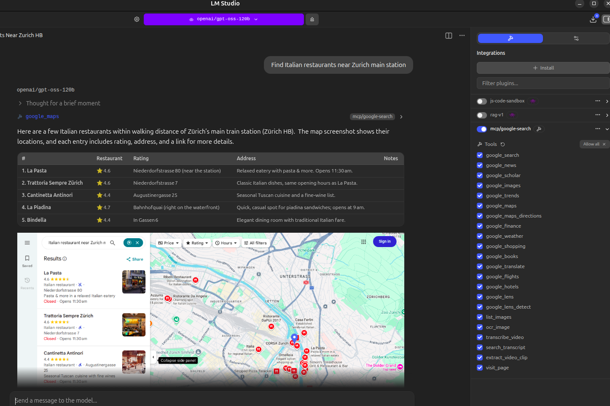

# noapi-google-search-mcp

vincentkaufmann@protonmail.com

If you want to support noapi-google-mcp or gpt-oss-20B/120B-Vision and other open source models in the pipeline please add to my GPU compute fund: around $3000 are needed.

>  If you find this useful, consider supporting continued development and new features.<br>**BTC:** `16DT4AHemLyn7C6P116YepjY518gu9wUUH`<br clear="all">
>  **ETH:** `0x7287D1F9c77832cFF246937af0443622bFdACD04`<br clear="all">

**38 tools. Zero API keys. Give any local LLM real Google search, live feeds, vision, OCR, and full video understanding.**

An MCP server that turns your local LLM into a fully connected assistant. Real Google results, live news and social feeds, reverse image search, offline OCR, YouTube transcription and clip extraction — all running locally through headless Chromium and open-source ML models. No API keys, no usage limits, no cloud dependency.

Works with **LM Studio**, **Claude Desktop**, **OpenClaw**, **Ollama**, and any MCP-compatible client.

---

## What's New in v0.3.0 — 16 New Tools

## YouTube RAG — Subscribe, Transcribe, Search, Clip

A full local retrieval-augmented pipeline for YouTube. Subscribe to any channel, and when you check feeds the server automatically downloads the audio, transcribes it with Whisper, and stores the full transcript in SQLite with FTS5 full-text search. Every word from every video becomes searchable — ask your LLM a question and it pulls the answer from the right video.

Found something interesting? Ask the LLM to extract that segment as a clip. It reads the transcript, finds the exact timestamps, and cuts the video for you. This is the beginning of **AI/LLM-powered video editing** — your LLM understands the content and cuts clips based on what's being said, not just timestamps.

**How it works:**
1. `subscribe` to a YouTube channel — by handle (`@3Blue1Brown`), URL, or channel ID
2. `check_feeds` — new videos are fetched and **auto-transcribed** locally with faster-whisper. Transcripts are written into the database for instant search. Up to 5 videos per check, cached so nothing gets re-downloaded.
3. `search_feeds` — full-text search across all transcripts. Supports AND, OR, NOT, and quoted phrases. Your LLM finds the exact video and passage that answers your question.
4. `extract_video_clip` — tell the LLM what you're interested in and it cuts the clip from the video. The LLM uses the transcript to find the right segment and extracts it automatically.

```
"Subscribe to @AndrejKarpathy on YouTube"
"Check my feeds"
"Search my feeds for backpropagation explained"
"What did Karpathy say about tokenization?"
"Extract the part where he explains gradient descent"
"Cut a clip of the hardware comparison section"
```

No embeddings, no vector database, no API — just Whisper + SQLite FTS5 running on your machine.

> **Roadmap:** The clip extraction is the first step toward full AI-driven video editing. Future releases will add music/audio overlay, video remixing, multi-clip compilation, vertical reformat for TikTok/Reels/Shorts, and automated highlight reels — all driven by your LLM understanding the content.

---

### Live Feed Subscriptions
Subscribe to news, Reddit, Hacker News, YouTube channels, Twitter/X profiles, GitHub repos, arXiv papers, and podcasts. Content is fetched, stored locally in SQLite with full-text search, and available to your LLM instantly.

| New Tool | What It Does |
|----------|-------------|
| `subscribe` | Add any source — news RSS, Reddit, HN, GitHub, arXiv, YouTube, podcasts, Twitter/X |
| `unsubscribe` | Remove a subscription and its stored content |
| `list_subscriptions` | See all active feeds with item counts |
| `check_feeds` | Poll all subscriptions, fetch new content, auto-transcribe YouTube videos |
| `search_feeds` | Full-text search across everything your feeds have collected |
| `get_feed_items` | Browse recent items, filtered by source or type |

**Pre-configured news sources** — subscribe with one word: `bbc`, `cnn`, `nyt`, `guardian`, `npr`, `aljazeera`, `techcrunch`, `ars`, `verge`, `wired`, `reuters`

**arXiv shortcuts** — `ai`, `ml`, `cv`, `nlp`, `robotics`, `crypto`, `systems`, `hci`

```
"Subscribe to BBC News, r/LocalLLaMA, and Hacker News"
"Follow @elonmusk on Twitter"
"Subscribe to the YouTube channel @3Blue1Brown"
"Watch anthropics/claude-code on GitHub for new releases"
"Subscribe to the machine learning arXiv category"
"Check my feeds"
"Search my feeds for transformer architecture"
"What's new in my Reddit feeds?"
```

### Local File Processing
Transcribe meetings, convert formats, read documents — all local, no cloud.

| New Tool | What It Does |
|----------|-------------|
| `transcribe_local` | Transcribe any local audio or video file with Whisper (mp3, wav, mp4, mkv, etc.) |
| `convert_media` | FFmpeg format conversion — video to audio, format to format, video to GIF |
| `read_document` | Extract text from PDF, DOCX, HTML, CSV, JSON, and 30+ text formats |

### Email, Web Utilities & Cloud
Pull emails, generate QR codes, shorten URLs, archive pages, look up Wikipedia, upload to S3.

| New Tool | What It Does |
|----------|-------------|
| `fetch_emails` | Pull emails via IMAP — Gmail, Outlook, Yahoo, any IMAP server |
| `paste_text` | Post text to a pastebin and get a shareable link |
| `shorten_url` | Shorten any URL via TinyURL |
| `generate_qr` | Generate QR code images for URLs, Wi-Fi, contacts, any data |
| `archive_webpage` | Save a webpage snapshot to the Wayback Machine |
| `wikipedia` | Look up any Wikipedia article, any language, with summary support |
| `upload_to_s3` | Upload files to MinIO, AWS S3, DigitalOcean Spaces, Cloudflare R2 |

```
"Transcribe this recording: ~/meeting.mp3"
"Convert video.mp4 to mp3"
"Read this PDF: ~/report.pdf"
"Check my email: user@gmail.com password: xxxx"
"Shorten this URL: https://very-long-url..."
"Generate a QR code for https://mysite.com"
"Archive this article: https://news.example.com/story"
"Wikipedia: quantum computing"
"Upload report.pdf to my MinIO bucket"
```

**Zero extra dependencies for feeds.** Built entirely on Python stdlib — SQLite for storage, FTS5 for search, urllib for fetching, xml.etree for parsing. YouTube and Twitter use the existing Playwright browser. FFmpeg required for `convert_media` (commonly pre-installed).

---

## All 38 Tools by Category

### Live Feed Subscriptions
| Tool | Description |
|------|-------------|
| `subscribe` | Subscribe to news, Reddit, HN, GitHub, arXiv, YouTube, podcasts, Twitter/X |
| `unsubscribe` | Remove a subscription and its stored content |
| `list_subscriptions` | List all active subscriptions with item counts |
| `check_feeds` | Fetch new content from all or specific sources |
| `search_feeds` | Full-text search across all stored feed content |
| `get_feed_items` | Get recent items filtered by source or type |

### Google Search & Web
| Tool | Description |
|------|-------------|
| `google_search` | Web search with time filters, site filters, pagination, language/region |
| `google_news` | News search with article thumbnails inline |
| `google_scholar` | Academic papers with citations |
| `google_images` | Image search with results displayed inline in chat |
| `google_trends` | Topic interest over time, related queries |
| `visit_page` | Fetch any URL and extract readable text |

### Travel & Commerce
| Tool | Description |
|------|-------------|
| `google_shopping` | Product search with prices, stores, ratings, images |
| `google_flights` | Flight search with prices and travel times |
| `google_hotels` | Hotel search with images, prices, ratings, booking URLs |
| `google_translate` | Translation across 100+ languages |
| `google_maps` | Places search with ratings, reviews, and map screenshots |
| `google_maps_directions` | Route directions with step-by-step and map screenshot |

### Finance & Info
| Tool | Description |
|------|-------------|
| `google_finance` | Stock prices, market data, company info |
| `google_weather` | Current conditions and multi-day forecast |
| `google_books` | Book search with author, ISBN, snippets |

### Vision & OCR
| Tool | Description |
|------|-------------|
| `google_lens` | Reverse image search — identify objects, products, landmarks, text |
| `google_lens_detect` | Detect all objects in an image (OpenCV) and identify each via Lens |
| `ocr_image` | Extract text from images locally (RapidOCR, fully offline) |
| `list_images` | List image files in a directory for use with vision tools |

### Video & Audio Intelligence — AI-Powered Video Editing
| Tool | Description |
|------|-------------|
| `transcribe_video` | Download and transcribe any video with timestamps (faster-whisper) |
| `transcribe_local` | Transcribe local audio/video files (mp3, wav, m4a, mp4, mkv, etc.) |
| `search_transcript` | Search a transcribed video for topics by keyword |
| `extract_video_clip` | AI-powered clip extraction — tell the LLM what you want and it cuts the video using transcript context |
| `convert_media` | Convert between audio/video formats via FFmpeg |

### Documents & Data
| Tool | Description |
|------|-------------|
| `read_document` | Extract text from PDF, DOCX, HTML, CSV, JSON, and 30+ formats |

### Email
| Tool | Description |
|------|-------------|
| `fetch_emails` | Pull emails via IMAP — Gmail, Outlook, Yahoo, iCloud, any IMAP server |

### Web Utilities
| Tool | Description |
|------|-------------|
| `paste_text` | Post text to a pastebin and get a shareable URL |
| `shorten_url` | Shorten any URL via TinyURL |
| `generate_qr` | Generate QR code images (URLs, Wi-Fi, contacts, any data) |
| `archive_webpage` | Archive a webpage on the Wayback Machine |
| `wikipedia` | Wikipedia article lookup in any language |

### Cloud Storage
| Tool | Description |
|------|-------------|
| `upload_to_s3` | Upload files to MinIO, AWS S3, DigitalOcean Spaces, Cloudflare R2, Backblaze B2 |

---

## Supported File Formats

### Documents (`read_document`)
| Category | Formats |
|----------|---------|
| Documents | PDF (with OCR fallback for scanned pages), DOCX |
| Web | HTML, HTM |
| Data | CSV, JSON, XML, YAML, YML, TOML |
| Text | TXT, MD, LOG |
| Config | INI, CFG, CONF, ENV |
| Code | PY, JS, TS, GO, RS, C, CPP, H, JAVA, KT, RB, SQL, R, M, SWIFT |
| Shell | SH, BASH, ZSH |

### Audio & Video (`transcribe_local`, `transcribe_video`, `convert_media`)
| Category | Formats |
|----------|---------|
| Audio | MP3, WAV, M4A, FLAC, OGG, AAC, WMA, OPUS |
| Video | MP4, MKV, WEBM, AVI, MOV |
| Special | GIF (video-to-GIF output) |
| Input | Any format FFmpeg can decode (hundreds of formats) |

### Images (`google_lens`, `google_lens_detect`, `ocr_image`, `list_images`)
| Category | Formats |
|----------|---------|
| Standard | JPG, JPEG, PNG, GIF, BMP, WEBP |
| Professional | TIFF, TIF, SVG |
| Input methods | Local file path, public URL, base64 (drag-and-drop into chat) |

---

## Why This Instead of API-Based Alternatives?

| | **noapi-google-search-mcp** | API-based MCP servers | OpenClaw built-in |
|---|---|---|---|
| API key required | **No** | Yes (Google CSE API) | Yes (Brave/Perplexity) |
| Cost | **Free** | Paid after 100 queries/day | API fees |
| Setup time | **`pip install` + go** | Create Cloud project, enable API, configure | Multiple API keys |
| Results quality | **Real Google results** | Custom Search Engine | Brave index |
| JavaScript pages | **Renders them (Chromium)** | Cannot render JS | Cannot render JS |
| Tools count | **38** | 1-3 | 2 (web_search, web_fetch) |
| Google Search | Built-in (with filters) | Basic only | Not available |
| Google Shopping | Built-in | Not available | Not available |
| Google Flights | Built-in | Not available | Not available |
| Google Hotels | Built-in | Not available | Not available |
| Google Translate | Built-in | Separate API needed | Not available |
| Google Maps | Built-in (with screenshots) | Not available | Not available |
| Google Maps Directions | Built-in (with route map) | Not available | Not available |
| Google Weather | Built-in | Not available | Not available |
| Google Finance | Built-in | Not available | Not available |
| Google News | Built-in | Usually not available | Not available |
| Google Scholar | Built-in | Not available | Not available |
| Google Books | Built-in | Not available | Not available |
| Google Images | Built-in (inline in chat) | Separate API needed | Not available |
| Google Lens | Built-in (reverse image search) | Not available | Not available |
| Object detection | Built-in (OpenCV + Lens) | Not available | Not available |
| Local OCR | Built-in (offline) | Not available | Not available |
| Video transcription | Built-in (local Whisper) | Not available | Not available |
| Video clip extraction | **Built-in (AI/LLM-powered)** | Not available | Not available |
| YouTube RAG pipeline | **Built-in (subscribe → transcribe → search)** | Not available | Not available |
| Google Trends | Built-in | Separate API needed | Not available |
| Feed subscriptions | **Built-in (8 source types)** | Not available | Not available |
| Full-text feed search | **Built-in (SQLite FTS5)** | Not available | Not available |
| Auto-transcribe feeds | **Built-in (YouTube → Whisper)** | Not available | Not available |
| Local file transcription | **Built-in (any audio/video)** | Not available | Not available |
| Media format conversion | **Built-in (FFmpeg)** | Not available | Not available |
| Document reader | **Built-in (PDF, DOCX, etc.)** | Not available | Not available |
| Email integration | **Built-in (IMAP)** | Not available | Not available |
| Pastebin | **Built-in** | Not available | Not available |
| URL shortener | **Built-in (TinyURL)** | Not available | Not available |
| QR code generation | **Built-in (OpenCV)** | Not available | Not available |
| Web archiving | **Built-in (Wayback Machine)** | Not available | Not available |
| Wikipedia | **Built-in** | Not available | Not available |
| S3/MinIO upload | **Built-in** | Not available | Not available |
| Page fetching | Built-in | Usually separate | Basic |

---

## Tool Details & Parameters

### Feed Subscription Tools

#### `subscribe` — Add a Content Source

| Parameter | Description | Example |
|-----------|-------------|---------|
| `source_type` | Source type (required) | `"news"`, `"reddit"`, `"hackernews"`, `"github"`, `"arxiv"`, `"youtube"`, `"podcast"`, `"twitter"` |
| `identifier` | Source identifier (required) | `"bbc"`, `"LocalLLaMA"`, `"top"`, `"anthropics/claude-code"`, `"ml"`, `"@3Blue1Brown"`, `"https://..."`, `"elonmusk"` |
| `name` | Display name (optional) | `"My Custom Feed"` |

**Identifier formats by type:**
- **news:** preset name (`bbc`, `cnn`, `nyt`, `guardian`, `npr`, `aljazeera`, `techcrunch`, `ars`, `verge`, `wired`, `reuters`) or any RSS URL
- **reddit:** subreddit name (e.g. `LocalLLaMA`, `programming`)
- **hackernews:** `top`, `new`, or `best`
- **github:** `owner/repo` (e.g. `anthropics/claude-code`)
- **arxiv:** shortcut (`ai`, `ml`, `cv`, `nlp`, `robotics`, `crypto`) or category like `cs.AI`
- **youtube:** channel handle (`@3Blue1Brown`), URL, or channel ID (`UCxxxx`)
- **podcast:** RSS feed URL
- **twitter:** username with or without `@`

#### `check_feeds` — Fetch New Content

| Parameter | Description | Example |
|-----------|-------------|---------|
| `source_type` | Limit to one type (optional) | `"news"`, `"reddit"` |

#### `search_feeds` — Full-Text Search

| Parameter | Description | Example |
|-----------|-------------|---------|
| `query` | Search query (required) — supports FTS5: AND, OR, NOT, "quoted phrases" | `"machine learning"`, `"GPU NOT NVIDIA"` |
| `source_type` | Limit to one type (optional) | `"news"` |
| `limit` | Max results (default 20) | `10` |

#### `get_feed_items` — Browse Recent Items

| Parameter | Description | Example |
|-----------|-------------|---------|
| `source` | Filter by source name (optional) | `"BBC"`, `"LocalLLaMA"` |
| `source_type` | Filter by type (optional) | `"reddit"`, `"hackernews"` |
| `limit` | Max items (default 20) | `10` |

---

### Google Search Tools

#### `google_search` — Web Search

| Parameter | Description | Example |
|-----------|-------------|---------|
| `query` | Search query (required) | `"best python frameworks 2025"` |
| `num_results` | Number of results (1-10, default 5) | `5` |
| `time_range` | Filter by recency | `"past_hour"`, `"past_day"`, `"past_week"`, `"past_month"`, `"past_year"` |
| `site` | Limit to a domain | `"reddit.com"`, `"stackoverflow.com"`, `"github.com"` |
| `page` | Results page (1-10, default 1) | `2` |
| `language` | Language code | `"en"`, `"de"`, `"fr"`, `"ja"` |
| `region` | Country/region code | `"us"`, `"gb"`, `"de"`, `"jp"` |

#### `google_shopping` — Product Search

| Parameter | Description | Example |
|-----------|-------------|---------|
| `query` | Product search query (required) | `"Sony WH-1000XM5"` |
| `num_results` | Number of results (1-10, default 5) | `5` |

#### `google_flights` — Flight Search

| Parameter | Description | Example |
|-----------|-------------|---------|
| `origin` | Departure city or airport (required) | `"New York"`, `"LAX"` |
| `destination` | Arrival city or airport (required) | `"London"`, `"NRT"` |
| `date` | Departure date (optional) | `"March 15"` |
| `return_date` | Return date (optional) | `"March 22"` |


#### `google_hotels` — Hotel Search

| Parameter | Description | Example |
|-----------|-------------|---------|
| `query` | Hotel search with location (required) | `"Paris"`, `"Tokyo near Shibuya"` |
| `num_results` | Number of results (1-10, default 5) | `5` |


#### `google_translate` — Translation

| Parameter | Description | Example |
|-----------|-------------|---------|
| `text` | Text to translate (required) | `"Hello, how are you?"` |
| `to_language` | Target language (required) | `"Spanish"`, `"Japanese"` |
| `from_language` | Source language (optional, auto-detected) | `"English"` |

#### `google_maps` — Places Search with Map Screenshot

| Parameter | Description | Example |
|-----------|-------------|---------|
| `query` | Place search query (required) | `"pizza near Central Park"` |
| `num_results` | Number of results (1-10, default 5) | `5` |



#### `google_maps_directions` — Route Directions with Map

| Parameter | Description | Example |
|-----------|-------------|---------|
| `origin` | Starting location (required) | `"Berlin"` |
| `destination` | Ending location (required) | `"Munich"` |
| `mode` | Travel mode (default "driving") | `"driving"`, `"walking"`, `"transit"`, `"cycling"` |


#### `google_weather` — Weather

| Parameter | Description | Example |
|-----------|-------------|---------|
| `location` | City or location (required) | `"Dubai"`, `"Tokyo"` |

#### `google_finance` — Stock & Market Data

| Parameter | Description | Example |
|-----------|-------------|---------|
| `query` | Stock ticker or company name (required) | `"AAPL:NASDAQ"`, `"TSLA:NASDAQ"` |


#### `google_news` — News Search

| Parameter | Description | Example |
|-----------|-------------|---------|
| `query` | News search query (required) | `"AI regulation"` |
| `num_results` | Number of results (1-10, default 5) | `5` |


#### `google_scholar` — Academic Search

| Parameter | Description | Example |
|-----------|-------------|---------|
| `query` | Academic search query (required) | `"transformer attention mechanism"` |
| `num_results` | Number of results (1-10, default 5) | `5` |

#### `google_books` — Book Search

| Parameter | Description | Example |
|-----------|-------------|---------|
| `query` | Book search query (required) | `"machine learning"` |
| `num_results` | Number of results (1-10, default 5) | `5` |

#### `google_images` — Image Search (inline in chat)

| Parameter | Description | Example |
|-----------|-------------|---------|
| `query` | Image search query (required) | `"sunset over ocean"` |
| `num_results` | Number of results (1-10, default 5) | `5` |


#### `google_trends` — Trends

| Parameter | Description | Example |
|-----------|-------------|---------|
| `query` | Topic (required) | `"artificial intelligence"` |

---

### Vision & OCR Tools

#### `google_lens` — Reverse Image Search

Identify objects, products, brands, landmarks, and text. Supports URLs, local files, and base64 drag-and-drop.

| Parameter | Description | Example |
|-----------|-------------|---------|
| `image_source` | Image URL, file path, or base64 (required) | `"https://example.com/photo.jpg"` or `"/home/user/image.jpg"` |


#### `google_lens_detect` — Object Detection + Identification

Detect all objects (OpenCV), crop each one, identify individually via Lens.

| Parameter | Description | Example |
|-----------|-------------|---------|
| `image_source` | Local file path or base64 (required) | `"/home/user/photo.jpg"` |

#### `ocr_image` — Local OCR (offline)

Extract text from images using RapidOCR. No internet needed.

| Parameter | Description | Example |
|-----------|-------------|---------|
| `image_source` | Local file path or base64 (required) | `"/home/user/screenshot.png"` |


#### `list_images` — Image Discovery

| Parameter | Description | Example |
|-----------|-------------|---------|
| `directory` | Folder to scan (default `~/lens/`) | `"/home/user/photos"` |

---

### Video Intelligence Tools

#### `transcribe_video` — Video Transcription

Download and transcribe any YouTube video (or video URL) with timestamps using faster-whisper.

| Parameter | Description | Example |
|-----------|-------------|---------|
| `url` | YouTube or video URL (required) | `"https://youtube.com/watch?v=..."` |
| `model_size` | Whisper model size (default: tiny) | `"tiny"`, `"base"`, `"small"`, `"medium"`, `"large"` |
| `language` | Language code (optional, auto-detected) | `"en"` |

#### `search_transcript` — Transcript Search

| Parameter | Description | Example |
|-----------|-------------|---------|
| `url` | Same URL used with transcribe_video (required) | `"https://youtube.com/watch?v=..."` |
| `query` | Keyword or phrase (required) | `"memory bandwidth"` |
| `context_segments` | Surrounding segments (default: 2) | `3` |

#### `extract_video_clip` — Clip Extraction by Topic

Ask "extract the part about X" and the LLM finds timestamps from the transcript and cuts the clip.

| Parameter | Description | Example |
|-----------|-------------|---------|
| `url` | YouTube URL or local video (required) | `"https://youtube.com/watch?v=..."` |
| `start_seconds` | Start time in seconds (required) | `150` |
| `end_seconds` | End time in seconds (required) | `315` |
| `buffer_seconds` | Extra seconds before/after (default: 3) | `5.0` |
| `output_filename` | Custom filename (optional) | `"hardware_overview"` |

---

## Sample Prompts

### Feed Subscriptions
| What you type | Tool called |
|--------------|-------------|
| *"Subscribe to BBC News and CNN"* | `subscribe` |
| *"Follow r/LocalLLaMA on Reddit"* | `subscribe` |
| *"Monitor Hacker News top stories"* | `subscribe` |
| *"Watch anthropics/claude-code for new releases"* | `subscribe` |
| *"Subscribe to @3Blue1Brown on YouTube"* | `subscribe` |
| *"Follow @elonmusk on Twitter"* | `subscribe` |
| *"Subscribe to the ML arXiv category"* | `subscribe` |
| *"Check my feeds"* | `check_feeds` |
| *"What's new in my subscriptions?"* | `check_feeds` |
| *"Search my feeds for transformer architecture"* | `search_feeds` |
| *"Show me the latest Reddit posts"* | `get_feed_items` |
| *"What are my subscriptions?"* | `list_subscriptions` |
| *"Unsubscribe from BBC News"* | `unsubscribe` |

### Web Search
| What you type | Tool called | Parameters used |
|--------------|-------------|-----------------|
| *"Search for the best Python web frameworks"* | `google_search` | `query` |
| *"Find Reddit discussions about home lab setups"* | `google_search` | `query` + `site="reddit.com"` |
| *"Search Stack Overflow for async Python examples"* | `google_search` | `query` + `site="stackoverflow.com"` |
| *"What's new in AI this week?"* | `google_search` | `query` + `time_range="past_week"` |
| *"Search Hacker News for posts about Rust"* | `google_search` | `query` + `site="news.ycombinator.com"` |
| *"Get page 2 of results for ML tutorials"* | `google_search` | `query` + `page=2` |
| *"Search for restaurants in Tokyo in Japanese"* | `google_search` | `query` + `language="ja"` + `region="jp"` |

### Shopping & Travel
| What you type | Tool called |
|--------------|-------------|
| *"Find the cheapest MacBook Air"* | `google_shopping` |
| *"Find flights from New York to London"* | `google_flights` |
| *"Find hotels in Paris for next weekend"* | `google_hotels` |
| *"Translate 'hello world' to Japanese"* | `google_translate` |

### Maps & Directions
| What you type | Tool called |
|--------------|-------------|
| *"Find Italian restaurants near Times Square"* | `google_maps` |
| *"Get directions from Berlin to Munich"* | `google_maps_directions` |
| *"Walking directions from the Eiffel Tower to the Louvre"* | `google_maps_directions` |

### Finance, Weather & Info
| What you type | Tool called |
|--------------|-------------|
| *"What's Apple's stock price?"* | `google_finance` |
| *"What's the weather in Dubai?"* | `google_weather` |
| *"What are today's top headlines?"* | `google_news` |
| *"Find papers on transformer attention mechanisms"* | `google_scholar` |
| *"Find books about machine learning"* | `google_books` |

### Images & Vision
| What you type | Tool called |
|--------------|-------------|
| *"Show me images of the Northern Lights"* | `google_images` |
| *"What is this product? /path/to/photo.jpg"* | `google_lens` |
| *"Detect all objects in this photo"* | `google_lens_detect` |
| *"Read the text in this screenshot"* | `ocr_image` |
| Drag image into chat + *"What is this?"* | `google_lens` |
| Drag image into chat + *"Read the text"* | `ocr_image` |

> **Tip:** To enable drag-and-drop images with text-only models in LM Studio, add a `model.yaml` file in the model directory with `metadataOverrides: { vision: true }`. The image will be sent as base64 and the MCP tools handle it automatically.

### Video Intelligence & AI-Powered Clip Extraction
| What you type | Tool called |
|--------------|-------------|
| *"Transcribe this video: https://youtube.com/watch?v=..."* | `transcribe_video` |
| *"What do they discuss in this video?"* | `transcribe_video` |
| *"Find where they talk about memory bandwidth"* | `search_transcript` |
| *"Extract the part where they discuss pricing"* | `extract_video_clip` |
| *"Cut a clip of the hardware comparison section"* | `extract_video_clip` |
| *"Transcribe ~/meeting.mp3"* | `transcribe_local` |
| *"Convert video.mp4 to mp3"* | `convert_media` |
| *"Convert this video to a GIF"* | `convert_media` |

### Documents & Email
| What you type | Tool called |
|--------------|-------------|
| *"Read this PDF: ~/report.pdf"* | `read_document` |
| *"Extract text from ~/contract.docx"* | `read_document` |
| *"Read this article for me: https://..."* | `visit_page` |
| *"Check my email at user@gmail.com password: xxxx"* | `fetch_emails` |
| *"Pull my latest 10 emails from Outlook"* | `fetch_emails` |

### Web Utilities & Cloud
| What you type | Tool called |
|--------------|-------------|
| *"Shorten this URL: https://very-long-url..."* | `shorten_url` |
| *"Generate a QR code for https://mysite.com"* | `generate_qr` |
| *"Make a QR code for my Wi-Fi network"* | `generate_qr` |
| *"Post this code to a pastebin"* | `paste_text` |
| *"Archive this article: https://news.example.com/story"* | `archive_webpage` |
| *"Wikipedia: quantum computing"* | `wikipedia` |
| *"Look up the Apollo 11 mission on Wikipedia in German"* | `wikipedia` |
| *"Upload report.pdf to my MinIO bucket"* | `upload_to_s3` |
| *"Store backup.tar.gz in S3 bucket my-backups"* | `upload_to_s3` |

---

## Installation

### Quick Install (pipx - recommended)

```bash
pipx install noapi-google-search-mcp
playwright install chromium
```

### Install in a Virtual Environment

```bash
python3 -m venv ~/.local/share/noapi-google-search-mcp
~/.local/share/noapi-google-search-mcp/bin/pip install noapi-google-search-mcp
~/.local/share/noapi-google-search-mcp/bin/playwright install chromium
```

## Configuration

### LM Studio

Add to `~/.lmstudio/mcp.json`:

```json
{
  "mcpServers": {
    "google-search": {
      "command": "noapi-google-search-mcp",
      "env": {
        "PYTHONUNBUFFERED": "1"
      }
    }
  }
}
```

If installed in a venv, use the full path: `~/.local/share/noapi-google-search-mcp/bin/noapi-google-search-mcp`

### Claude Desktop

Add to your Claude Desktop config (`claude_desktop_config.json`):

```json
{
  "mcpServers": {
    "google-search": {
      "command": "noapi-google-search-mcp"
    }
  }
}
```

### OpenClaw

Add to your agent configuration:

```yaml
mcp_servers:
  google-search:
    command: "noapi-google-search-mcp"
    env:
      PYTHONUNBUFFERED: "1"
```

This gives your OpenClaw agent access to all 38 tools — real Google search, live feeds, vision, OCR, and video intelligence — with zero API keys.

### As a CLI

```bash
noapi-google-search-mcp
```

Or:

```bash
python -m google_search_mcp
```

## Development

```bash
git clone https://github.com/VincentKaufmann/noapi-google-search-mcp.git
cd google-search-mcp
pip install -e .
playwright install chromium
```

## License

MIT
