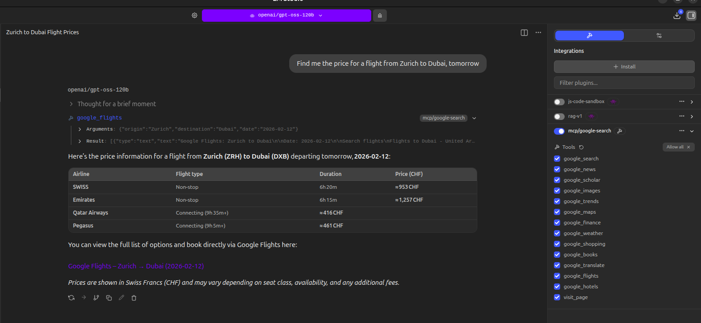
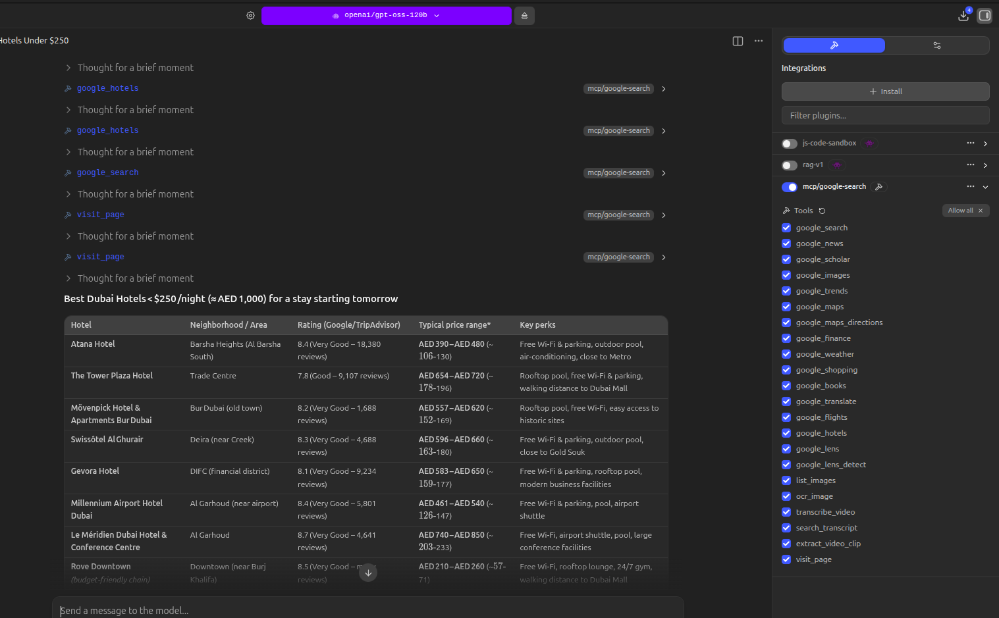
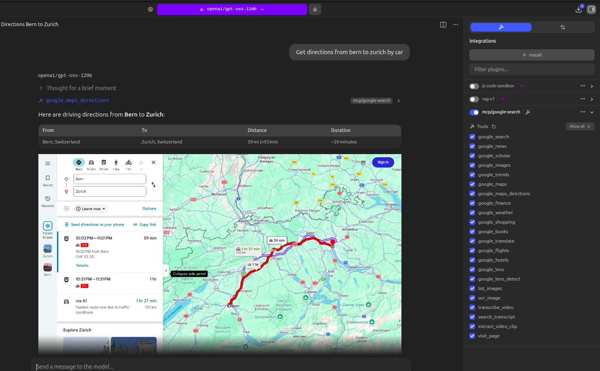
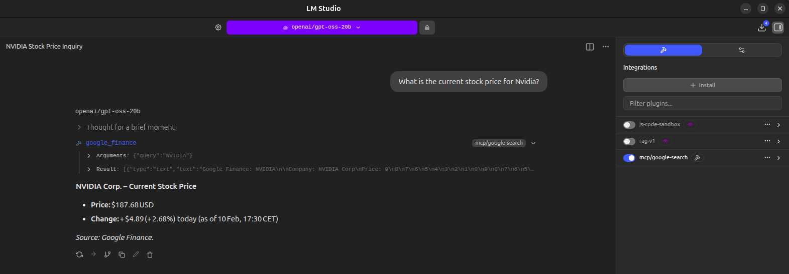
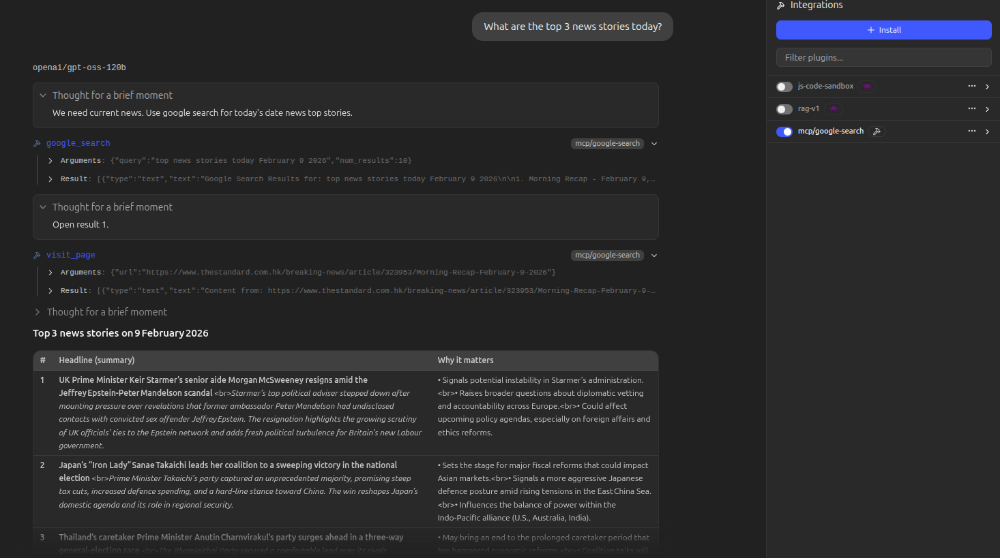
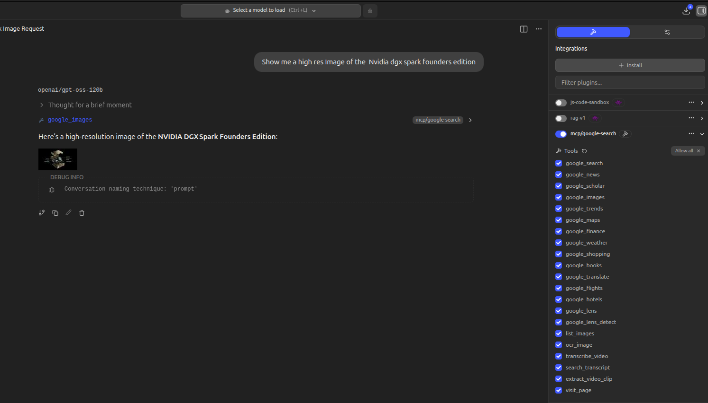
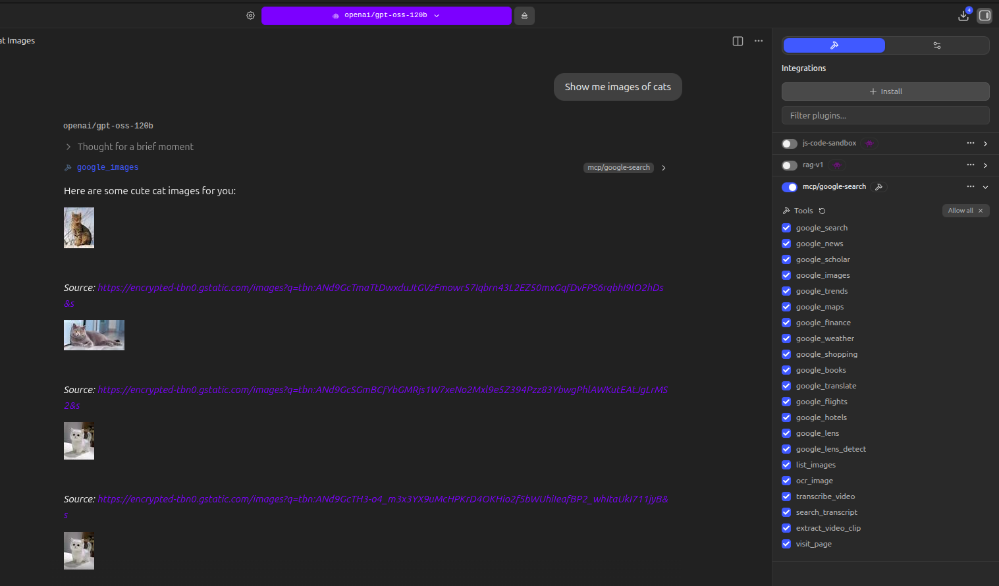
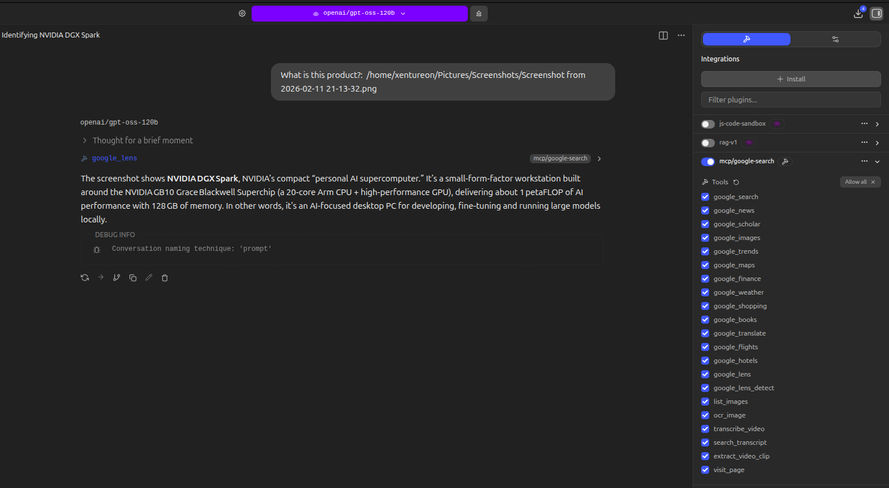
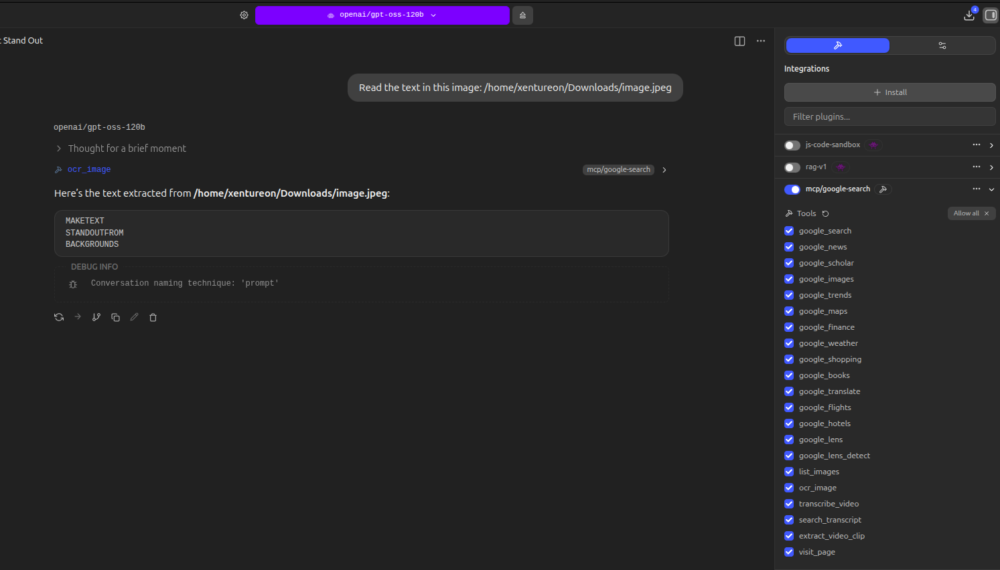

# noapi-google-search-mcp

vincentkaufmann@protonmail.com

**Give any LLM real Google search, vision, local OCR, and YouTube video understanding. No API key, no vision model needed.**

**Google Search, Google Lens + OpenCV object detection + local OCR + YouTube transcription, Q&A & clip extraction by topic for Local LLMs**

An MCP (Model Context Protocol) server that gives your local LLM real Google search, browsing, vision, text-reading, and full video understanding. Paste a YouTube link and the LLM transcribes it locally, answers questions about the content, and extracts video clips by topic - just ask "extract the part about X" and the LLM finds the right timestamps from the transcript and cuts the clip for you. Uses headless Chromium via Playwright for search, Google Lens for image identification, RapidOCR for offline OCR, and faster-whisper for local video transcription. No Google API key, no Custom Search Engine setup, no usage limits - just real Google results.

Works with LM Studio, Claude Desktop, and any MCP-compatible client.

## Why This Instead of API-Based Alternatives?

| | **noapi-google-search-mcp** | API-based MCP servers |
|---|---|---|
| API key required | No | Yes (Google CSE API) |
| Cost | Free | Paid after 100 queries/day |
| Setup time | `pip install` + go | Create Google Cloud project, enable API, get key, configure CSE |
| Results quality | Real Google results | Custom Search Engine (different ranking) |
| JavaScript pages | Renders them (Chromium) | Cannot render JS |
| Google Search | Built-in (with filters) | Basic only |
| Google Shopping | Built-in | Not available |
| Google Flights | Built-in | Not available |
| Google Hotels | Built-in | Not available |
| Google Translate | Built-in | Separate API needed |
| Google Maps | Built-in | Not available |
| Google Maps Directions | Built-in (with route map screenshot) | Not available |
| Google Weather | Built-in | Not available |
| Google Finance | Built-in | Not available |
| Google News | Built-in | Usually not available |
| Google Scholar | Built-in | Not available |
| Google Books | Built-in | Not available |
| Google Images | Built-in (inline in chat) | Separate API needed |
| Google Lens | Built-in (reverse image search) | Not available |
| Object detection | Built-in (OpenCV + Google Lens per object) | Not available |
| Local OCR | Built-in (RapidOCR, works offline) | Not available |
| Video transcription | Built-in (faster-whisper, local) | Not available |
| Video clip extraction | Built-in (extract segments by topic) | Not available |
| Google Trends | Built-in | Separate API needed |
| Page fetching | Built-in `visit_page` tool | Usually separate |

## Tools

### `google_search` - Web Search

Search Google and get structured results with titles, URLs, and snippets.

**Parameters:**
| Parameter | Description | Example |
|-----------|-------------|---------|
| `query` | Search query (required) | `"best python frameworks 2025"` |
| `num_results` | Number of results (1-10, default 5) | `5` |
| `time_range` | Filter by recency | `"past_hour"`, `"past_day"`, `"past_week"`, `"past_month"`, `"past_year"` |
| `site` | Limit to a domain | `"reddit.com"`, `"stackoverflow.com"`, `"github.com"`, `"arxiv.org"`, `"news.ycombinator.com"` |
| `page` | Results page (1-10, default 1) | `2` for next page |
| `language` | Language code | `"en"`, `"de"`, `"fr"`, `"es"`, `"ja"`, `"zh"` |
| `region` | Country/region code | `"us"`, `"gb"`, `"de"`, `"fr"`, `"jp"` |

**How your LLM uses it:** The LLM automatically sees these parameters in the tool definition. When you ask "search Reddit for Python tips from the past week", it will call `google_search(query="Python tips", site="reddit.com", time_range="past_week")`.

---

### `google_shopping` - Product Search

Search Google Shopping for products with prices, stores, and ratings.

**Parameters:**
| Parameter | Description | Example |
|-----------|-------------|---------|
| `query` | Product search query (required) | `"Sony WH-1000XM5"` |
| `num_results` | Number of results (1-10, default 5) | `5` |

Returns: product name, price, store, and rating.

---

### `google_flights` - Flight Search

Search Google Flights for flight options, prices, and travel times.

**Parameters:**
| Parameter | Description | Example |
|-----------|-------------|---------|
| `origin` | Departure city or airport (required) | `"New York"`, `"LAX"` |
| `destination` | Arrival city or airport (required) | `"London"`, `"NRT"` |
| `date` | Departure date (optional) | `"March 15"`, `"2025-03-15"` |
| `return_date` | Return date for round trips (optional) | `"March 22"` |



---

### `google_hotels` - Hotel Search

Search for hotels and accommodation with prices and ratings.

**Parameters:**
| Parameter | Description | Example |
|-----------|-------------|---------|
| `query` | Hotel search with location (required) | `"Paris"`, `"Tokyo near Shibuya"` |
| `num_results` | Number of results (1-10, default 5) | `5` |



---

### `google_translate` - Translation

Translate text between languages using Google Translate.

**Parameters:**
| Parameter | Description | Example |
|-----------|-------------|---------|
| `text` | Text to translate (required) | `"Hello, how are you?"` |
| `to_language` | Target language (required) | `"Spanish"`, `"Japanese"`, `"French"` |
| `from_language` | Source language (optional, auto-detected) | `"English"`, `"German"` |

---

### `google_maps` - Places Search

Search Google Maps for restaurants, businesses, and places with ratings, addresses, and reviews.

**Parameters:**
| Parameter | Description | Example |
|-----------|-------------|---------|
| `query` | Place search query (required) | `"pizza near Central Park"` |
| `num_results` | Number of results (1-10, default 5) | `5` |

---

### `google_maps_directions` - Route Directions with Map Screenshot

Get driving, walking, transit, or cycling directions between two locations. Returns distance, duration, step-by-step route info, and an inline screenshot of the map showing the full route.

**Parameters:**
| Parameter | Description | Example |
|-----------|-------------|---------|
| `origin` | Starting location (required) | `"Berlin"`, `"Times Square, New York"` |
| `destination` | Ending location (required) | `"Munich"`, `"Central Park, New York"` |
| `mode` | Travel mode (default "driving") | `"driving"`, `"walking"`, `"transit"`, `"cycling"` |

Returns: distance, duration, route steps, and an inline map screenshot showing the route.



---

### `google_weather` - Weather Lookup

Get current weather conditions and forecast for any location worldwide.

**Parameters:**
| Parameter | Description | Example |
|-----------|-------------|---------|
| `location` | City or location (required) | `"Dubai"`, `"New York"`, `"Tokyo"` |

Returns: temperature (°C/°F), condition, precipitation, humidity, wind, and multi-day forecast.

---

### `google_finance` - Stock & Market Data

Look up stock prices, market data, and company information from Google Finance.

**Parameters:**
| Parameter | Description | Example |
|-----------|-------------|---------|
| `query` | Stock ticker with exchange or company name (required) | `"AAPL:NASDAQ"`, `"TSLA:NASDAQ"` |

Returns: current price, change, market info, key stats, and company description.



---

### `google_news` - News Search

Search Google News for recent headlines with source and timestamp.

**Parameters:**
| Parameter | Description | Example |
|-----------|-------------|---------|
| `query` | News search query (required) | `"AI regulation"` |
| `num_results` | Number of results (1-10, default 5) | `5` |



---

### `google_scholar` - Academic Search

Search Google Scholar for papers, citations, and research.

**Parameters:**
| Parameter | Description | Example |
|-----------|-------------|---------|
| `query` | Academic search query (required) | `"transformer attention mechanism"` |
| `num_results` | Number of results (1-10, default 5) | `5` |

Returns: title, URL, authors, citation count, and snippet for each paper.

---

### `google_books` - Book Search

Search Google Books for books, textbooks, and publications.

**Parameters:**
| Parameter | Description | Example |
|-----------|-------------|---------|
| `query` | Book search query (required) | `"machine learning"` |
| `num_results` | Number of results (1-10, default 5) | `5` |

---

### `google_images` - Image Search (with inline images)

Search Google Images and display results directly in chat. Images are returned inline so you can see them without leaving the conversation.

**Parameters:**
| Parameter | Description | Example |
|-----------|-------------|---------|
| `query` | Image search query (required) | `"sunset over ocean"` |
| `num_results` | Number of results (1-10, default 5) | `5` |





---

### `google_lens` - Reverse Image Search

Identify objects, products, brands, landmarks, and text in images using Google Lens. Gives vision capabilities to text-only models.

Supports image URLs, local file paths, and base64-encoded images (drag-and-drop in LM Studio).

**Parameters:**
| Parameter | Description | Example |
|-----------|-------------|---------|
| `image_source` | Image URL, local file path, or base64 image data (required) | `"https://example.com/photo.jpg"` or `"/home/user/image.jpg"` or drag image into chat |

Returns: identified object/product name, description, visual matches, text found in image, and related products with prices.



---

### `google_trends` - Trends Lookup

Check Google Trends for topic interest, related topics, and related queries.

**Parameters:**
| Parameter | Description | Example |
|-----------|-------------|---------|
| `query` | Topic to check trends for (required) | `"artificial intelligence"` |

---

### `google_lens_detect` - Object Detection + Identification

Detect all objects in an image using OpenCV, crop each one, and identify them individually via Google Lens. Useful when an image contains multiple items and you want each identified separately.

Supports local file paths and base64-encoded images (drag-and-drop in LM Studio).

**Parameters:**
| Parameter | Description | Example |
|-----------|-------------|---------|
| `image_source` | Local file path or base64 image data (required) | `"/home/user/photo.jpg"` or drag image into chat |

Returns: per-object identification from Google Lens, including the original full image results.

---

### `ocr_image` - Local OCR (no internet needed)

Extract text from images locally using RapidOCR (PaddleOCR models on ONNX Runtime). Runs entirely offline. Reads screenshots, documents, photos of signs, labels, receipts, or any image containing text.

Gives text-reading capabilities to text-only models without needing a vision model or internet. Supports local file paths and base64-encoded images (drag-and-drop in LM Studio).

**Parameters:**
| Parameter | Description | Example |
|-----------|-------------|---------|
| `image_source` | Local file path or base64 image data (required) | `"/home/user/screenshot.png"` or drag image into chat |

Returns: extracted text sorted by position, with confidence scores.



**Example output:**
```
OCR Results for: /home/user/screenshot.png
Text regions found: 12

--- Extracted Text ---
NVIDIA-SMI 580.95.05  Driver Version: 580.95.05  CUDA Version: 13.0
GPU Name  Persistence-M  Bus-Id  Disp.A
NVIDIA GB10  On  00000000F:01:00.0

--- Detailed Results (with confidence) ---
[88%] NVIDIA-SMI 580.95.05
[88%] Driver Version: 580.95.05
[84%] CUDA Version: 13.0
```

---

### `transcribe_video` - Video Transcription

Download and transcribe YouTube videos (or any video URL) locally with timestamps using faster-whisper. The LLM can then answer questions about the video, point to specific timestamps, and identify when topics start and end.

**Parameters:**
| Parameter | Description | Example |
|-----------|-------------|---------|
| `url` | YouTube URL or any video URL (required) | `"https://youtube.com/watch?v=..."` |
| `model_size` | Whisper model: tiny/base/small/medium/large (default: base) | `"small"` |
| `language` | Language code, auto-detected if empty | `"en"` |

**Example output:**
```
Video Transcript
Title: How to Build a Home Server
Channel: TechChannel
Duration: 15:30
Language: en (confidence: 98%)

--- Transcript ---
[0:00 - 0:05] Welcome back to the channel.
[0:05 - 0:12] Today we're going to build a home server from scratch.
[0:12 - 0:25] First, let's talk about the hardware you'll need...
```

---

### `search_transcript` - Transcript Search

Search a previously transcribed video for segments matching a keyword or phrase. Returns matching segments with timestamps and surrounding context, ready for clip extraction.

**Parameters:**
| Parameter | Description | Example |
|-----------|-------------|---------|
| `url` | Same video URL used with transcribe_video (required) | `"https://youtube.com/watch?v=..."` |
| `query` | Keyword or phrase to search for (required) | `"memory bandwidth"` |
| `model_size` | Must match transcription model (default: tiny) | `"tiny"` |
| `context_segments` | Surrounding segments to include (default: 2) | `3` |

---

### `extract_video_clip` - Video Clip Extraction by Topic

Extract video clips by topic. After transcription, just ask "extract the part about X" and the LLM reads the transcript, finds the right timestamps, and cuts the clip automatically. A buffer is added before and after to avoid cutting off content. Clips are saved to `~/clips/`.

**Parameters:**
| Parameter | Description | Example |
|-----------|-------------|---------|
| `url` | YouTube URL or local video file path (required) | `"https://youtube.com/watch?v=..."` |
| `start_seconds` | Start time in seconds (required) | `150` (for 2:30) |
| `end_seconds` | End time in seconds (required) | `315` (for 5:15) |
| `buffer_seconds` | Extra seconds before/after (default: 3) | `5.0` |
| `output_filename` | Custom filename without extension (optional) | `"hardware_overview"` |

---

### `list_images` - Image Discovery

List image files in a directory so text-only models can discover and pass them to `google_lens`, `google_lens_detect`, or `ocr_image`. Default directory: `~/lens/`.

**Parameters:**
| Parameter | Description | Example |
|-----------|-------------|---------|
| `directory` | Folder to scan (optional, default `~/lens/`) | `"/home/user/photos"` |

---

### `visit_page` - Page Fetcher

Fetch any URL and extract readable text content. Use after search to read full articles.

**Parameters:**
| Parameter | Description | Example |
|-----------|-------------|---------|
| `url` | Full URL to fetch (required) | `"https://example.com/article"` |

## How Does the LLM Know About These Tools?

You don't need to teach the LLM anything. MCP automatically exposes all tool names, descriptions, and parameters to the model. The LLM picks the right tool and parameters automatically based on your request.

## Sample Prompts

Here are example prompts you can type into LM Studio or Claude Desktop, and which tool the LLM will use:

### Web Search
| What you type | Tool called | Parameters used |
|--------------|-------------|-----------------|
| *"Search for the best Python web frameworks"* | `google_search` | `query` |
| *"Find Reddit discussions about home lab setups"* | `google_search` | `query` + `site="reddit.com"` |
| *"Search Stack Overflow for async Python examples"* | `google_search` | `query` + `site="stackoverflow.com"` |
| *"What's new in AI this week?"* | `google_search` | `query` + `time_range="past_week"` |
| *"Search Hacker News for posts about Rust"* | `google_search` | `query` + `site="news.ycombinator.com"` |
| *"Find GitHub repos for MCP servers"* | `google_search` | `query` + `site="github.com"` |
| *"Get page 2 of results for machine learning tutorials"* | `google_search` | `query` + `page=2` |
| *"Search for restaurants in Tokyo in Japanese"* | `google_search` | `query` + `language="ja"` + `region="jp"` |
| *"Find German news about the EU from the past month"* | `google_search` | `query` + `language="de"` + `time_range="past_month"` |

### Shopping
| What you type | Tool called |
|--------------|-------------|
| *"Find the cheapest MacBook Air"* | `google_shopping` |
| *"Compare prices for Sony WH-1000XM5 headphones"* | `google_shopping` |
| *"How much does a Nintendo Switch cost?"* | `google_shopping` |
| *"Search for running shoes under $100"* | `google_shopping` |

### Flights
| What you type | Tool called |
|--------------|-------------|
| *"Find flights from New York to London"* | `google_flights` |
| *"Search for cheap flights from LA to Tokyo"* | `google_flights` |
| *"Flights from San Francisco to Paris on March 15"* | `google_flights` |
| *"How much are flights from Dubai to Bangkok?"* | `google_flights` |

### Hotels
| What you type | Tool called |
|--------------|-------------|
| *"Find hotels in Paris for next weekend"* | `google_hotels` |
| *"Search for cheap hotels in Tokyo"* | `google_hotels` |
| *"Best hotels near Times Square New York"* | `google_hotels` |
| *"Find 5-star hotels in Dubai"* | `google_hotels` |

### Translation
| What you type | Tool called |
|--------------|-------------|
| *"Translate 'hello world' to Japanese"* | `google_translate` |
| *"How do you say 'thank you' in French?"* | `google_translate` |
| *"Translate this to Spanish: The weather is nice today"* | `google_translate` |
| *"What does 'Guten Morgen' mean in English?"* | `google_translate` |

### Maps & Places
| What you type | Tool called |
|--------------|-------------|
| *"Find Italian restaurants near Times Square"* | `google_maps` |
| *"Where are the best coffee shops in Berlin?"* | `google_maps` |
| *"Search for hotels in Tokyo"* | `google_maps` |
| *"Find EV charging stations in San Francisco"* | `google_maps` |
| *"What are the top-rated gyms in London?"* | `google_maps` |

### Directions (with route map screenshot)
| What you type | Tool called |
|--------------|-------------|
| *"Get directions from Berlin to Munich"* | `google_maps_directions` |
| *"How do I drive from New York to Boston?"* | `google_maps_directions` |
| *"Walking directions from the Eiffel Tower to the Louvre"* | `google_maps_directions` |
| *"Transit route from Shibuya to Akihabara"* | `google_maps_directions` |
| *"Cycling route from Golden Gate Bridge to Fisherman's Wharf"* | `google_maps_directions` |
| *"Show me the route from London to Edinburgh"* | `google_maps_directions` |

### Weather
| What you type | Tool called |
|--------------|-------------|
| *"What's the weather in Dubai?"* | `google_weather` |
| *"Is it going to rain in London today?"* | `google_weather` |
| *"What's the temperature in New York?"* | `google_weather` |
| *"Weather forecast for Tokyo this week"* | `google_weather` |

### Finance & Stocks
| What you type | Tool called |
|--------------|-------------|
| *"What's Apple's stock price?"* | `google_finance` |
| *"How is Tesla stock doing?"* | `google_finance` |
| *"Look up NVIDIA market cap"* | `google_finance` |
| *"How is the S&P 500 doing today?"* | `google_finance` |

### News
| What you type | Tool called |
|--------------|-------------|
| *"What are today's top headlines?"* | `google_news` |
| *"Any recent news about the stock market?"* | `google_news` |
| *"What happened in the Japan election?"* | `google_news` |

### Academic Research
| What you type | Tool called |
|--------------|-------------|
| *"Find papers on transformer attention mechanisms"* | `google_scholar` |
| *"Look up academic research about CRISPR"* | `google_scholar` |
| *"What does the research say about intermittent fasting?"* | `google_scholar` |

### Books
| What you type | Tool called |
|--------------|-------------|
| *"Find books about machine learning"* | `google_books` |
| *"Search for books by Stephen King"* | `google_books` |
| *"What are the best books on Python programming?"* | `google_books` |

### Images (displayed inline in chat)
| What you type | Tool called |
|--------------|-------------|
| *"Show me images of the Northern Lights"* | `google_images` |
| *"Show me what a DGX Spark looks like"* | `google_images` |
| *"Find diagrams of neural network architecture"* | `google_images` |

### Reverse Image Search
| What you type | Tool called |
|--------------|-------------|
| *"What is this product? https://example.com/photo.jpg"* | `google_lens` |
| *"Identify this image: /home/user/photos/device.jpg"* | `google_lens` |
| *"What brand is this? [image URL or file path]"* | `google_lens` |
| *"Read the text in this image: https://..."* | `google_lens` |

### Trends
| What you type | Tool called |
|--------------|-------------|
| *"What's trending in tech right now?"* | `google_trends` |
| *"Is Python more popular than JavaScript?"* | `google_trends` |

### Object Detection
| What you type | Tool called |
|--------------|-------------|
| *"Detect and identify all objects in /home/user/photo.jpg"* | `google_lens_detect` |
| *"What are all the items in this photo? /path/to/image.jpg"* | `google_lens_detect` |

### OCR (Text Extraction)
| What you type | Tool called |
|--------------|-------------|
| *"Read the text in this image: /home/user/screenshot.png"* | `ocr_image` |
| *"OCR this document: /home/user/receipt.jpg"* | `ocr_image` |
| *"What does this label say? /home/user/photo.jpg"* | `ocr_image` |
| *"Extract text from /home/user/document.png"* | `ocr_image` |

### Drag-and-Drop Images (LM Studio with vision override)
| What you do | Tool called |
|------------|-------------|
| Drag image into chat + *"What is this?"* | `google_lens` |
| Drag image into chat + *"Read the text"* | `ocr_image` |
| Drag image into chat + *"Detect all objects"* | `google_lens_detect` |
| Drag image into chat + *"Reverse image search this"* | `google_lens` |

> **Tip:** To enable drag-and-drop images with text-only models in LM Studio, add a `model.yaml` file in the model directory with `metadataOverrides: { vision: true }`. The image will be sent as base64 and the MCP tools handle it automatically.

### Video Transcription
| What you type | Tool called |
|--------------|-------------|
| *"Transcribe this video: https://youtube.com/watch?v=..."* | `transcribe_video` |
| *"What do they discuss in this video? https://..."* | `transcribe_video` |
| *"Summarize this YouTube video: https://..."* | `transcribe_video` |
| *"At what timestamp do they talk about X in this video?"* | `transcribe_video` |

### Video Clip Extraction by Topic
| What you type | Tool called |
|--------------|-------------|
| *"Extract the part where they talk about memory bandwidth"* | `extract_video_clip` |
| *"Save the segment where they discuss pricing"* | `extract_video_clip` |
| *"Cut out the section about the hardware specs"* | `extract_video_clip` |

### Page Reading
| What you type | Tool called |
|--------------|-------------|
| *"Read this article for me: https://..."* | `visit_page` |
| *"What does this page say? https://..."* | `visit_page` |

## Installation

### Quick Install (pipx - recommended)

```bash
pipx install noapi-google-search-mcp
playwright install chromium
```

This puts `noapi-google-search-mcp` on your PATH so you can use it directly.

### Install in a Virtual Environment

If you don't have pipx, install in a dedicated venv:

```bash
python3 -m venv ~/.local/share/noapi-google-search-mcp
~/.local/share/noapi-google-search-mcp/bin/pip install noapi-google-search-mcp
~/.local/share/noapi-google-search-mcp/bin/playwright install chromium
```

## Configuration

### LM Studio

Add to `~/.lmstudio/mcp.json`:

**If installed with pipx** (command is on PATH):

```json
{
  "mcpServers": {
    "google-search": {
      "command": "noapi-google-search-mcp",
      "env": {
        "PYTHONUNBUFFERED": "1"
      }
    }
  }
}
```

**If installed in a venv** (use the full path):

```json
{
  "mcpServers": {
    "google-search": {
      "command": "~/.local/share/noapi-google-search-mcp/bin/noapi-google-search-mcp",
      "env": {
        "PYTHONUNBUFFERED": "1"
      }
    }
  }
}
```

### Claude Desktop

Add to your Claude Desktop config (`claude_desktop_config.json`):

```json
{
  "mcpServers": {
    "google-search": {
      "command": "noapi-google-search-mcp"
    }
  }
}
```

> If installed in a venv, use the full path to the binary instead.

### As a CLI

```bash
noapi-google-search-mcp
```

Or:

```bash
python -m google_search_mcp
```

## Development

```bash
git clone https://github.com/VincentKaufmann/noapi-google-search-mcp.git
cd google-search-mcp
pip install -e .
playwright install chromium
```

## License

MIT
